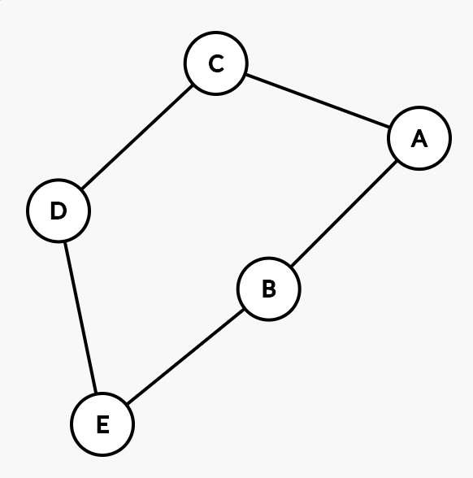

# Homework 1: Graph ADT & Traversals

Follow the instructions [here](https://make-school-courses.github.io/CS-2.2-Graphs-Recursion/#/Assignments/01-Graph-ADT) to complete this assignment.

## Discussion Questions

### HW 1

1. How is Breadth-first Search different in graphs than in trees? Describe the differences in your own words.

While both BFS for trees and graphs are both 'level-order' because of the way graphs are structured, they can be cyclic, which needs to be accounted for by tracking visited nodes.  For trees, once it's visited, it won't be revisted.

2. What is one application of Breadth-first Search (besides social networks)? Describe how BFS is used for that application. If you need some ideas, check out [this article](https://www.geeksforgeeks.org/applications-of-breadth-first-traversal/?ref=rp).

One application would be to optimize drive routes  for making deliveries.  Each house/building would be a vertex and the route would be the shortest path from start vertex to target vertex.

### HW 2

1. Compare and contrast Breadth-first Search and Depth-first Search by providing one similarity and one difference.

One similarity is that they both traverse the entire graph, all vertices and edges but Breadth-first is implemented using a queue, while depth first is implemented with a stack.

2. Explain why a Depth-first Search traversal does not necessarily find the shortest path between two vertices. What is one such example of a graph where a DFS search would not find the shortest path?

Depth-first Search doesn't guarantee to find the shortest path because it fully explores a path before looking for another one and as such, if there is more than one path to get from start to target, the first path it finds is not guaranteed to be the shorter one.

For example, in this graph, DFS may find the path A -> C -> D -> E before it finds A -> B -> E

3. Explain why we cannot perform a topological sort on a graph containing a cycle.
   
Topological sort won't work on a graph containing a cycle because by function/definition, topological sort is an ordering that for every directed edge from vertex u to vertex v, u must come before v.  With a cycle, the loop means it is impossible to sort like that.